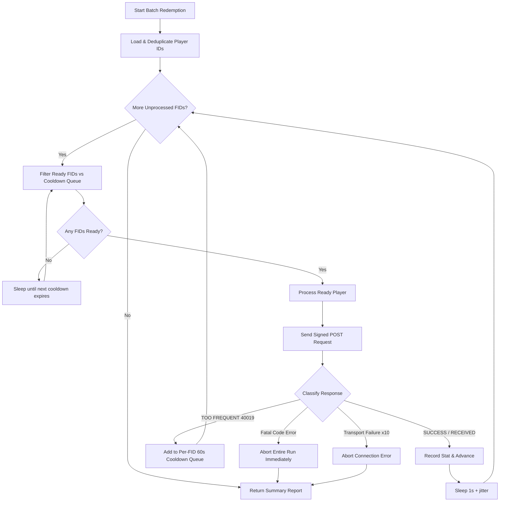

# Kingshot Gift Code Redemption System

Technical documentation of the Kingshot Gift Code API v2.0.0 integration in `utils/redeem_code.py`.

---

## 1. Overview

The redemption engine handles single and batch gift code redemptions for Kingshot player IDs (`fid`) and Kingdom IDs (`kid`). It communicates directly with the Kingshot Gift Code HTTP API, implementing dynamic signing, browser anti-bot header rotation, rate-limit cooldown queues, and status classification.

---

## 2. API Architecture & Security Protocol

### 2.1 Endpoint
- **Base URL**: `https://kingshot-giftcode.centurygame.com`
- **Redeem Endpoint**: `POST /api/gift_code`
- **Content-Type**: `application/x-www-form-urlencoded`

### 2.2 Payload Structure & MD5 Signing
Every request requires four parameters plus an MD5 signature computed with secret key `mN4!pQs6JrYwV9`.

| Parameter | Type | Description |
|---|---|---|
| `fid` | String | Player Account ID |
| `kid` | String | Kingdom ID (Required by API; defaults to empty string or user-supplied value) |
| `cdk` | String | Gift code string |
| `time` | String | Current UTC Unix timestamp in seconds (`int(time.time())`) |
| `sign` | String | MD5 hash of alphabetized parameter string + encryption key |

#### Signature Calculation Algorithm (`encode_data`):
1. Sort payload keys alphabetically (`cdk`, `fid`, `kid`, `time`).
2. Construct parameter string: `cdk=<cdk>&fid=<fid>&kid=<kid>&time=<time>`
3. Append secret key: `<parameter_string>mN4!pQs6JrYwV9`
4. Calculate MD5 hex digest.

```python
# Signature calculation
sorted_keys = sorted(data.keys())
encoded = "&".join(f"{key}={data[key]}" for key in sorted_keys)
sign = hashlib.md5(f"{encoded}mN4!pQs6JrYwV9".encode()).hexdigest()
```

### 2.3 Browser Header Rotation
To prevent anti-bot detection, HTTP request headers rotate across requests:
- Dynamic User-Agent strings (Chrome, Brave, Edge across Windows, macOS, Linux).
- Matching `sec-ch-ua`, `sec-ch-ua-mobile`, and `sec-ch-ua-platform` hints.
- Fixed `origin` and `referer` pointing to `https://kingshot-giftcode.centurygame.com`.

---

## 3. Data Processing & Player Input

`load_players()` reads player data from `data/playerIDs.txt` or custom CSV paths:

1. **Multi-Encoding Reader**: Tries `utf-8-sig`, `utf-8`, `latin-1`, and `gbk`.
2. **Line Parser (`parse_player_line`)**:
   - Supports `#` comment lines.
   - Parses single `fid` or `fid,kid` / `fid kid` pairs (`kid <= 999999`).
3. **Deduplication**: Deduplicates player IDs, preserving the specific kingdom ID if provided.

---

## 4. Response Classification & Error Codes

The API returns JSON containing `msg` and `err_code`. `classify()` maps responses to status keys:

| Status Key | `err_code` | Raw `msg` | Description / Action |
|---|---|---|---|
| `SUCCESS` | `0` | `SUCCESS` | Successfully redeemed |
| `RECEIVED` | `40008` | `RECEIVED` | Already claimed by player |
| `SAME TYPE EXCHANGE` | `40011` | `SAME TYPE EXCHANGE` | Successfully redeemed (same type) |
| `TIME ERROR` | `40007` | `TIME ERROR` | **Fatal**: Code expired |
| `CDK NOT FOUND` | `40014` | `CDK NOT FOUND` | **Fatal**: Invalid/unknown code |
| `USED` | `40005` | `USED` | **Fatal**: Total claim limit reached |
| `TIMEOUT RETRY` | `40004` | `TIMEOUT RETRY` | Transient: Server timeout |
| `TOO FREQUENT` | `40019` | `TOO FREQUENT` | Rate limited on `fid` |
| `USER INFO ERROR` | `40020` | `USER INFO ERROR` | Invalid kingdom for player |
| `ROLE NOT EXIST` | `40001` | `*not exist*` | Non-existent player ID |
| `STOVE_LV ERROR` | `40006` | `STOVE_LV ERROR` | Town Center level too low |
| `RECHARGE_MONEY ERROR` | `40017` | `RECHARGE_MONEY ERROR` | Minimum spending requirement not met |
| `RECHARGE_MONEY_VIP ERROR` | `40018` | `RECHARGE_MONEY_VIP ERROR` | Minimum VIP level requirement not met |

---

## 5. Execution Loop & Retry Management

### 5.1 Batch Redemption Flow (`redeem_for_all`)



### 5.2 Retry & Failure Protection Rules
- **Rate Limit (`TOO FREQUENT`)**: On 40019, player ID is parked in `retry_queue` for 60 seconds (`TOO_FREQUENT_SLEEP`). Maximum 3 cooldown cycles per player.
- **Transport Errors**: HTTP 429/502/503/504 status codes trigger automatic exponential retries.
- **Consecutive Failures**: If 10 consecutive connection failures occur (`MAX_CONSECUTIVE_FAILURES`), processing aborts.
- **Fatal Error Abort**: If code returns `TIME ERROR`, `CDK NOT FOUND`, or `USED`, batch processing halts immediately.

---

## 6. Discord Cog Integration

The system interfaces with `cogs/code_redeem.py`:
- `update_file_from_public_url(doc_id, local_destination)`: Syncs `playerIDs.txt` from Google Docs.
- `redeem_for_all(giftCode, file_path)`: Executed off-thread (`asyncio.to_thread`) with progress notifications via Discord webhooks.
- `send_signed_post()` / `redeem_for_one()`: Handles single-player slash command requests (`/redeem-for-player`).
